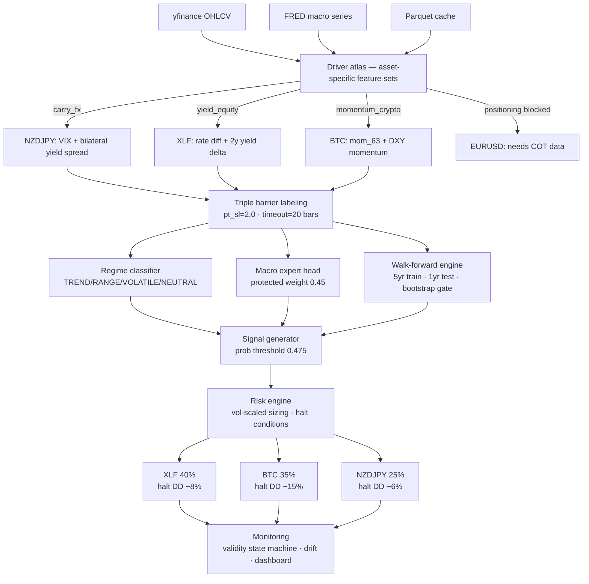

# QuantForge


**QuantForge** is a modular quantitative research framework focused on **macro-conditioned trading systems** across equities, FX, and crypto. It features a live 24/7 paper-trading engine with a real-time web dashboard and robust walk-forward validation infrastructure.

**This is a research and paper-trading system — not a production trading bot.**

---

## Live Paper Trading

The paper-trading engine runs continuously with the following allocation across 6 assets and 5 distinct driver clusters:

| Asset     | Ticker      | Label    | Cluster       | Alloc | Key Features |
|-----------|-------------|----------|---------------|-------|------|
| XLF       | `XLF`       | tb20     | yield_equity  | 22%   | rate_diff, 2y_yield_delta_63, xlf_mom_63, xlf_vs_spy_63 |
| BTC       | `BTC-USD`   | tb20     | momentum_crypto | 20% | rate_diff, 2y_yield_delta_63, btc_mom_63, btc_vs_spy_63 |
| NZDJPY    | `NZDJPY=X`  | tb20     | carry_fx      | 15%   | vix_ma21, vix_delta_5, us_jp_10y_spread, nzdjpy_mom_21 |
| CADJPY    | `CADJPY=X`  | fwd60    | oil_carry     | 13%   | ca_jp_spread_mom_5, ca_jp_spread_mom_21, cadjpy_mom_21, vix_ma21 |
| USDCAD    | `USDCAD=X`  | tb20     | usd_macro     | 10%   | rate_diff, dxy_mom_21, vix_ma21, usdcad_mom_21 |
| GC=F      | `GC=F`      | fwd60    | real_asset    | 20%   | real_yield_delta_63, breakeven_delta_63, dxy_mom_63, gc_mom_63 |

### Run

```bash
./monitor_all
```

**Dashboard**: <http://127.0.0.1:5000>

- Engine refresh: every 30 minutes
- UI refresh: every 30 seconds

### Dashboard Features

- Portfolio summary (Total Value, Return, Unrealized P&L, Trade Count)
- Per-asset signal cards with confidence meters, position details, and P&L
- Live execution log
- Performance metrics (Profit Factor, Win Rate, Sharpe, Mean Confidence)
- Validity & Halt condition monitors
- Regime status and advisory bar

---

## Research Track

Primary validated asset: **XLF (Financial Select Sector SPDR ETF)** using a minimal 4-feature XGBoost model.

Additional walk-forward studies completed for: EURUSD, USDJPY, NZDJPY, Gold (GC), and QQQ.

### Model Specifications

- **Type**: XGBoost multiclass classifier (BUY / NEUTRAL / SELL)
- **Parameters**: 300 trees, max depth 2, learning rate 0.02
- **Labeling**: Triple-barrier (pt_sl=2.0, vertical barrier=20 bars)
- **Sizing**: Volatility-scaled positions
- **Validation**: Rolling walk-forward (5yr train / 1yr test / 1yr step)

### Research Results — XLF Walk-Forward (2019–2024)

| Year | Profit Factor | Net Return | Sharpe | Max DD   |
|------|---------------|------------|--------|----------|
| 2019 | 1.07          | +3.25%     | 0.41   | -4.8%    |
| 2020 | 1.03          | +5.12%     | 0.38   | -9.2%    |
| 2021 | 1.29          | +25.14%    | 1.12   | -6.1%    |
| 2022 | 0.98          | -6.25%     | -0.22  | -11.4%   |
| 2023 | 1.23          | +17.24%    | 0.95   | -5.7%    |
| 2024 | 1.34          | +21.95%    | 1.28   | -4.9%    |

**Average Annual Return (2019–2024): +11.08%**  
**CAGR**: ~10.4% | **Average Sharpe**: 0.65

---

## Advanced Architecture

| Module                    | Description |
|--------------------------|-----------|
| Module | Description |
|--------|-------------|
| MacroExpertHead | Asset-specific XGBoost (depth=2) with protected weight 0.45 — prevents price features drowning macro signal |
| RegimeClassifier | TREND/RANGE/VOLATILE/NEUTRAL — operates as risk/participation controller, not alpha source |
| DriverAtlas | Asset-to-feature-cluster routing: carry_fx, yield_equity, momentum_crypto, positioning |
| ValidityStateMachine | GREEN/YELLOW/RED capital allocation with PSI-gated hysteresis |
| WalkForwardEngine | 5yr rolling train, 1yr OOS test, bootstrap p<0.05 deployment gate |

---

## Key Findings

- Simplicity wins: 4-feature model consistently outperforms complex ensembles in walk-forward tests
- Asset-specific driver features are mandatory: generic macro features fail on 28/30 assets tested; pair-specific features (VIX + bilateral yield spread for NZDJPY) flipped 0/7 → 5/7 positive windows
- Near-zero portfolio correlation achieved: max pairwise PnL correlation 0.055 across XLF, BTC, NZDJPY — genuine diversification, not just different tickers
- Feature interference is a real failure mode: macro features drowned by 25 price features until protected weight architecture separated them
- Macro features describe environment, not price response: yield_slope and real_yield_10y removed from XLF model because they stayed bearish through 2023–2024 rally; 2y_yield_delta_63 (direction, not level) was the fix
- EURUSD blocked at daily frequency: 8 years walk-forward showed 1.65% CAGR; requires COT positioning data

---

## System Architecture



---

## Repository Structure

```text
QuantForge/
├── paper_trading/       # Live engine + Flask dashboard
│   └── models/          # Serialised model pickles
├── equity/              # Walk-forward research scripts
├── backtests/           # Core validation & metrics engine
├── models/              # Ensemble, regime, expert heads
│   ├── regime/          # Regime classifier
│   ├── ensemble/        # Model router
│   ├── mean_reversion/  # RSI + Bollinger for RANGE
│   ├── trend/           # Trend-following models
│   └── volatility/      # Volatility models
├── features/            # Feature engineering pipeline
├── labels/              # Triple-barrier & meta-labeling
├── signals/             # Signal filtering & thresholding
├── risk/                # Position sizing, exposure, drawdown
├── monitoring/          # Validity state machine, drift, MLflow
├── data/
│   ├── loaders/         # Downloaders and macro loaders
│   ├── raw/             # Raw OHLCV parquet files
│   ├── processed/       # Feature-engineered datasets
│   └── live/            # Runtime engine state
├── diagnostics/         # Model audits, sweeps, SHAP analysis
├── portfolio/           # HRP, risk parity (in progress)
├── execution/           # Broker stubs (Alpaca/IBKR)
├── configs/             # YAML configs per asset class
├── tests/               # Pytest test suite
├── docs/                # Project documentation
├── adr/                 # Architecture Decision Records
├── notebooks/           # Jupyter notebooks
├── .github/
│   └── workflows/       # CI pipeline
├── quantforge/          # Package root (version, logging)
├── main.py              # Minimal entry point
├── monitor_all          # Launch script (paper trading)
├── Makefile             # Dev targets
├── pyproject.toml       # Project metadata & deps
└── requirements.txt     # Pinned dependencies
```

---

## Documentation

Project documentation and architecture decisions live alongside the code:

| Path | Description |
|------|-------------|
| [`docs/`](docs/) | Project documentation — guides, references, deep-dives |
| [`adr/`](adr/) | Architecture Decision Records — key design decisions and their rationale |

ADR entries follow the standard [Michael Nygard template](https://github.com/joelparkerhenderson/architecture-decision-record) and are numbered sequentially.

---

## Setup

```bash
git clone git@github.com:manuelhorvey/QuantForge.git
cd QuantForge

python3 -m venv .venv
source .venv/bin/activate
pip install -r requirements.txt

export PYTHONPATH=$PYTHONPATH:.
```

---

## Quick Start

```bash
# Run walk-forward research
python equity/walk_forward_xlf.py

# Start live paper trading + dashboard
./monitor_all
```

---

## Roadmap

### Near Term (Q3 2026)

- Full broker integration (Alpaca / Interactive Brokers)
- Realistic slippage & spread modeling
- HRP / risk-parity portfolio allocator
- Enhanced drift detection & auto-retraining triggers

### Medium Term

- Real-time WebSocket dashboard
- Multi-timeframe signal fusion
- Expanded asset universe
- Meta-labeling layer

---

## Research backlog

Assets pending driver analysis: AUDJPY (carry_fx cluster), ETH-USD (momentum_crypto cluster), XLU/XLRE (yield_equity cluster), USDJPY (4/7 — needs BoJ intervention proxy).

Blocked pending data acquisition: EURUSD, GBPUSD (need CFTC COT weekly positioning data).

---

## Limitations

- Paper trading only (no real capital at risk)
- Limited number of fully validated assets
- Weekend data staleness for equities/FX
- No live execution or order management yet
- EURUSD and 27 other FX pairs untradeable with current feature set — requires COT/positioning data
- Model only valid when PSI confirms distribution stability; 2022–2025 produced RED validity on EURUSD system

---

## Disclaimer

This project is for **research and educational purposes only**. It is not financial advice. Trading involves substantial risk of loss. Past performance does not guarantee future results.

---

## Author

**MktOwl**  
Focus: Macro-driven systematic trading • Walk-forward validation • Production-grade research engineering

---

**Contributions, issues, and suggestions are welcome.**
