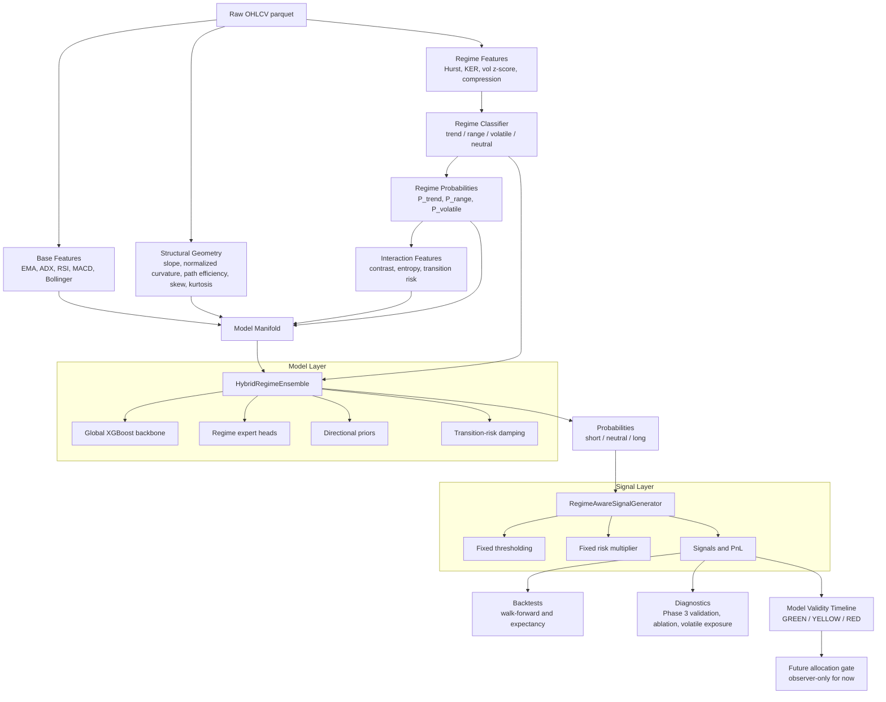

# QuantForge


QuantForge is a modular quantitative research framework for regime-conditioned FX strategy research. The current implementation focuses on EURUSD daily data and tests whether structural market geometry, regime conditioning, and model-validity gating can produce stable out-of-sample behavior under non-stationary market conditions.

This is a research system, not a production trading bot. The current stack is designed to answer three questions:

- Does price geometry contain predictive signal?
- Does regime structure preserve value or only add complexity?
- When is the model environment compatible enough to allocate risk?

---

## Current Architecture

```text
Raw OHLCV
  -> Base features
  -> Regime features and labels
  -> Structural geometry features
  -> Regime interaction features
  -> Hybrid regime ensemble
  -> Fixed downstream signal policy
  -> Expectancy / walk-forward / validity diagnostics
```

The current design separates model roles:

- Geometry features are the primary alpha representation.
- Regime classification acts as structural conditioning and exposure allocation.
- Signal generation uses one routing decision point inside the ensemble.
- Diagnostics decide whether the system should be trusted in a given market era.

---

## System Architecture



### Control Flow

The system has three separate control layers:

1. **Prediction control**: the hybrid ensemble decides how much the global model and regime experts contribute.
2. **Execution control**: the signal generator converts probabilities into fixed-threshold signals.
3. **Validity control**: diagnostics decide whether the environment is compatible with the model.

The validity layer is observer-only. It does not retrain models, tune thresholds, or change features. Its job is to classify whether the current market era should receive full, reduced, or no capital allocation.

### Data Contracts

The main model manifold combines:

```text
base indicator features
+ regime probability features
+ structural geometry features
+ regime interaction features
```

The regime classifier requires raw regime inputs such as:

```text
hurst, kaufman_er, adx, vol_zscore, compression
```

The walk-forward validator keeps these contracts separate:

- `X`: model manifold passed to the ensemble
- `regime_features`: raw classifier inputs passed to the signal generator
- `regimes`: training labels used to fit regime experts

---

## Project Structure

```text
QuantForge/
|-- backtests/
|   |-- expectancy_audit.py
|   |-- execution_simulator.py
|   |-- performance_metrics.py
|   `-- walk_forward.py
|-- configs/
|-- data/
|   |-- loaders/
|   |-- processed/
|   `-- raw/
|-- diagnostics/
|   |-- model_validity_timeline.py
|   |-- phase3_validation.py
|   |-- regime_ablation.py
|   |-- volatile_exposure_test.py
|   `-- supporting audits
|-- execution/
|-- features/
|   |-- base_features.py
|   |-- interaction_features.py
|   |-- regime_features.py
|   |-- structural_features.py
|   `-- supporting feature modules
|-- labels/
|-- models/
|   |-- hybrid_ensemble.py
|   |-- regime/
|   |-- trend/
|   |-- mean_reversion/
|   `-- volatility/
|-- monitoring/
|-- portfolio/
|-- risk/
|-- signals/
|   `-- signal_generator.py
`-- requirements.txt
```

---

## Feature Stack

### Base Features

Implemented in `features/base_features.py`:

- EMA spread
- ADX
- MACD difference
- RSI
- Bollinger z-score
- distance from EMA 20

### Regime Features

Implemented in `features/regime_features.py` and `models/regime/regime_classifier.py`:

- Hurst exponent
- Kaufman efficiency ratio
- ADX
- volatility z-score
- compression ratio
- session volatility profile
- probabilistic trend/range/volatile labels

The active regimes are:

- `trend`
- `range`
- `volatile`
- `neutral`

### Structural Geometry

Implemented in `features/structural_features.py`:

- rolling log-price slope
- scale-normalized curvature
- path efficiency
- rolling skew
- rolling kurtosis
- backward-looking tail ratio

Curvature is normalized by rolling log-price volatility so high-volatility periods do not dominate the geometry signal.

### Regime Interactions

Implemented in `features/interaction_features.py`:

- clipped regime contrast: `P_trend - P_range`
- EMA contrast
- slope contrast
- path efficiency contrast
- regime entropy
- transition risk

The regime ablation showed that these contrast features are useful as conditioning signals, especially `ema_contrast`.

---

## Model Layer

Implemented in `models/hybrid_ensemble.py`.

The current model is a hybrid XGBoost ensemble:

- global backbone trained on all samples
- regime-specific expert heads where enough data exists
- recency-weighted samples
- model-layer directional priors
- transition-risk damping

The regime layer is not treated as the main alpha source. Current diagnostics indicate it works better as a loss-prevention and exposure-allocation layer.

---

## Signal Layer

Implemented in `signals/signal_generator.py`.

The signal layer is intentionally simple:

- classify regime
- ask the hybrid ensemble for probabilities
- apply fixed probability thresholding
- apply fixed risk multiplier

Regime-specific routing happens once inside the ensemble. Downstream thresholding and risk sizing are kept stateless to avoid stacked regime decisions.

---

## Diagnostics

### Phase 3 Validation

Run:

```bash
export PYTHONPATH=$PYTHONPATH:. && python diagnostics/phase3_validation.py
```

Checks:

- no single feature dominates more than 40%
- path efficiency is used by at least one model
- transition risk reduces false positives around regime switches
- curvature SHAP importance beats a noise baseline
- trend/range/volatile directional consistency gates

Latest result:

```text
PHASE 3 STATUS: PASS
```

### Regime Ablation

Run:

```bash
export PYTHONPATH=$PYTHONPATH:. && python diagnostics/regime_ablation.py
```

This removes explicit regime-derived inputs and compares the no-regime model against the regime-aware path.

Latest interpretation:

- Regime structure is not the main alpha source.
- Regime structure improves participation and profit factor.
- Regime acts as structural conditioning and risk allocation.

### VOLATILE Exposure Test

Run:

```bash
export PYTHONPATH=$PYTHONPATH:. && python diagnostics/volatile_exposure_test.py
```

This freezes walk-forward probabilities and tests VOLATILE-only execution treatments:

- current threshold
- forced small exposure
- threshold sweep
- volatility-proportional sizing

Latest interpretation:

- forced exposure degrades results
- threshold relaxation around `0.36` showed conditional edge
- VOLATILE is undergated, not broadly directionally predictable

### Model Validity Timeline

Run:

```bash
export PYTHONPATH=$PYTHONPATH:. && python diagnostics/model_validity_timeline.py
```

This is the Phase 4 model-governance layer. It observes, scores, and classifies environment compatibility without changing model behavior.

Components:

- bounded performance score
- feature PSI
- regime distribution drift
- SHAP rank instability
- rolling consistency penalty
- GREEN/YELLOW/RED validity state

Latest EURUSD classification:

```text
2019  YELLOW
2020  YELLOW
2021  YELLOW
2022  RED
2023  YELLOW
2024  RED
2025  RED
2026  YELLOW
```

The timeline identifies 2022, 2024, and 2025 as model-validity failure periods.

---

## Backtesting

Run the current walk-forward validation:

```bash
export PYTHONPATH=$PYTHONPATH:. && python backtests/walk_forward.py
```

Latest EURUSD walk-forward summary:

```text
2019   expectancy  0.000312   PF 1.30   trades 253
2020   expectancy  0.000239   PF 1.19   trades 201
2021   expectancy  0.000241   PF 1.21   trades 122
2022   expectancy -0.000466   PF 0.82   trades 259
2023   expectancy -0.000070   PF 0.96   trades 191
2024   expectancy -0.000273   PF 0.82   trades 212
2025   expectancy -0.000766   PF 0.63   trades 88
2026   expectancy  0.001371   PF 3.01   trades 24
```

Interpretation:

- 2019-2021 are the strongest stable period.
- 2022-2025 show structural degradation.
- 2026 is encouraging but too small to validate.

---

## Research Workflow

Recommended loop:

```text
1. Generate or refresh data
2. Generate labels
3. Generate base, regime, structural, and interaction features
4. Train hybrid ensemble
5. Generate signals
6. Run expectancy audit
7. Run walk-forward validation
8. Run Phase 3 validation
9. Run ablations
10. Run model validity timeline
```

Useful commands:

```bash
export PYTHONPATH=$PYTHONPATH:. && python features/structural_features.py
export PYTHONPATH=$PYTHONPATH:. && python features/interaction_features.py
export PYTHONPATH=$PYTHONPATH:. && python models/hybrid_ensemble.py
export PYTHONPATH=$PYTHONPATH:. && python signals/signal_generator.py
export PYTHONPATH=$PYTHONPATH:. && python backtests/expectancy_audit.py
export PYTHONPATH=$PYTHONPATH:. && python backtests/walk_forward.py
```

---

## Installation

```bash
git clone <repo_url>
cd QuantForge
python3 -m venv .venv
source .venv/bin/activate
pip install -r requirements.txt
```

Basic smoke test:

```bash
python main.py
```

Most research scripts expect repository-root imports:

```bash
export PYTHONPATH=$PYTHONPATH:.
```

---

## Current Research State

What is working:

- structural geometry features are implemented
- regime-conditioned feature coupling is implemented
- hybrid global/expert ensemble is implemented
- Phase 3 validation passes
- regime ablation confirms the regime layer adds value as conditioning
- model validity timeline identifies non-stationary failure periods

Current bottlenecks:

- VOLATILE participation is fragile and sample-limited
- 2022-2025 EURUSD behavior breaks the learned mapping
- current validity layer is diagnostic only, not yet connected to allocation
- cross-asset validation is still early

Near-term research direction:

- make VOLATILE threshold policy config-driven
- stabilize per-window expectancy before portfolio allocation
- expand validation to GBPUSD and Gold
- use the model validity timeline as a capital gating layer

---

## Disclaimer

This project is for research, experimentation, and education.

Nothing here is financial advice or a guarantee of profitability. Markets are noisy, adversarial, and non-stationary. Past performance does not imply future results.

---

## Author

Built by MktOwl.
