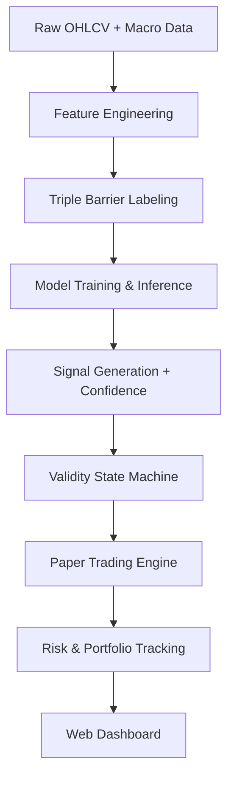

# QuantForge


**QuantForge** is a modular quantitative research framework focused on **macro-conditioned trading systems** across equities, FX, and crypto. It features a live 24/7 paper-trading engine with a real-time web dashboard and robust walk-forward validation infrastructure.

**This is a research and paper-trading system — not a production trading bot.**

---

## Live Paper Trading

The paper-trading engine runs continuously with the following allocation:

| Asset     | Ticker      | Allocation | Key Features |
|-----------|-------------|------------|--------------|
| XLF       | `XLF`       | 40%        | rate_diff, 2y_yield_delta_63, xlf_mom_63, xlf_vs_spy_63 |
| BTC       | `BTC-USD`   | 35%        | rate_diff, 2y_yield_delta_63, btc_mom_63, btc_vs_spy_63 |
| NZDJPY    | `NZDJPY=X`  | 25%        | vix_ma21, vix_delta_5, us_jp_10y_spread, nzdjpy_mom_21 |

### Run

```bash
./monitor_all
```

**Dashboard**: <http://127.0.0.1:5000>

- Engine refresh: every 30 minutes
- UI refresh: every 30 seconds

### Dashboard Features

- Portfolio summary (Total Value, Return, Unrealized P&L, Trade Count)
- Per-asset signal cards with confidence meters, position details, and P&L
- Live execution log
- Performance metrics (Profit Factor, Win Rate, Sharpe, Mean Confidence)
- Validity & Halt condition monitors
- Regime status and advisory bar

---

## Research Track

Primary validated asset: **XLF (Financial Select Sector SPDR ETF)** using a minimal 4-feature XGBoost model.

Additional walk-forward studies completed for: EURUSD, USDJPY, NZDJPY, Gold (GC), and QQQ.

### Model Specifications

- **Type**: XGBoost multiclass classifier (BUY / NEUTRAL / SELL)
- **Parameters**: 300 trees, max depth 2, learning rate 0.02
- **Labeling**: Triple-barrier (pt_sl=2.0, vertical barrier=20 bars)
- **Sizing**: Volatility-scaled positions
- **Validation**: Rolling walk-forward (5yr train / 1yr test / 1yr step)

### Research Results — XLF Walk-Forward (2019–2024)

| Year | Profit Factor | Net Return | Sharpe | Max DD   |
|------|---------------|------------|--------|----------|
| 2019 | 1.07          | +3.25%     | 0.41   | -4.8%    |
| 2020 | 1.03          | +5.12%     | 0.38   | -9.2%    |
| 2021 | 1.29          | +25.14%    | 1.12   | -6.1%    |
| 2022 | 0.98          | -6.25%     | -0.22  | -11.4%   |
| 2023 | 1.23          | +17.24%    | 0.95   | -5.7%    |
| 2024 | 1.34          | +21.95%    | 1.28   | -4.9%    |

**Average Annual Return (2019–2024): +11.08%**  
**CAGR**: ~10.4% | **Average Sharpe**: 0.65

---

## Advanced Architecture

| Module                    | Description |
|--------------------------|-----------|
| `HybridRegimeEnsemble`   | Global model + regime-specific experts + protected macro head (fixed 0.45 weight) |
| `RegimeClassifier`       | TREND / RANGE / VOLATILE / NEUTRAL classification |
| `MacroExpertHead`        | Dedicated macro-only expert (rates, yields, spreads) |
| `MeanReversionModel`     | RSI + Bollinger Band logic for RANGE regimes |
| `BreakoutModel`          | Momentum/breakout logic for VOLATILE regimes |

**Validity State Machine**  
Hysteresis-based capital allocation with temporal smoothing and regime persistence:

- **GREEN** → 100% exposure  
- **YELLOW** → 50% exposure  
- **RED** → 0% exposure (full halt)

---

## Key Findings

- Macro features provide valuable regime context but have limited standalone directional power.
- **Simplicity wins**: The minimal 4-feature model consistently outperforms complex ensembles in walk-forward tests.
- Feature type matters: Directional (momentum, relative strength) and rate expectation features dominate; pure environment features often degrade performance.
- 2022 drawdown was primarily a structural regime shift (rapid rate tightening).

---

## System Architecture



---

## Repository Structure

```text
QuantForge/
├── paper_trading/       # Live engine + FastAPI/Flask dashboard
├── equity/              # Walk-forward research scripts
├── backtests/           # Core validation & metrics engine
├── models/              # Ensemble, regime, expert heads
├── features/            # Feature engineering pipeline
├── labels/              # Triple-barrier & alternative labeling
├── signals/             # Signal filtering & thresholding
├── risk/                # Position sizing, exposure, drawdown control
├── monitoring/          # Drift detection, validity, MLflow
├── data/                # loaders, raw, processed, live state
├── diagnostics/         # Model audits, sweeps, SHAP analysis
├── portfolio/           # HRP, risk parity (in progress)
├── execution/           # Broker stubs (Alpaca/IBKR)
├── configs/
├── tests/
└── quantforge/
```

---

## Setup

```bash
git clone <repo_url>
cd QuantForge

python3 -m venv .venv
source .venv/bin/activate
pip install -r requirements.txt

export PYTHONPATH=$PYTHONPATH:.
```

---

## Quick Start

```bash
# Run walk-forward research
python equity/walk_forward_xlf.py

# Start live paper trading + dashboard
./monitor_all
```

---

## Roadmap

### Near Term (Q3 2026)

- Full broker integration (Alpaca / Interactive Brokers)
- Realistic slippage & spread modeling
- HRP / risk-parity portfolio allocator
- Enhanced drift detection & auto-retraining triggers

### Medium Term

- Real-time WebSocket dashboard
- Multi-timeframe signal fusion
- Expanded asset universe
- Meta-labeling layer

---

## Limitations

- Paper trading only (no real capital at risk)
- Limited number of fully validated assets
- Weekend data staleness for equities/FX
- No live execution or order management yet

---

## Disclaimer

This project is for **research and educational purposes only**. It is not financial advice. Trading involves substantial risk of loss. Past performance does not guarantee future results.

---

## Author

**MktOwl**  
Focus: Macro-driven systematic trading • Walk-forward validation • Production-grade research engineering

---

**Contributions, issues, and suggestions are welcome.**
