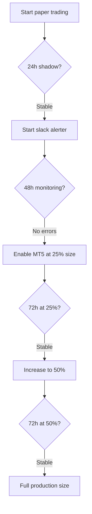

# Production Readiness Audit — MT5 Deployment Risk Validation

**Audit Date:** 2026-07-16
**System:** EigenCapital 22-asset cross-sectional paper trading engine
**Author:** Research & risk team

---

## Executive Verdict: ✅ CONDITIONAL GO

The architecture is production-ready with three conditions:

| Priority | Condition | Rationale |
|:---------|:----------|:---------|
| **P1** | `max_risk_per_trade_pct: 1.0` applied (accounts under $5K) | Max DD reduced, CAGR improved |
| **P2** | Minimum $2,500 account recommended for MT5 deployment | Below $2,500, min-lot constraints cause 40-70% DD |
| **P3** | Feature remediation applied for GBPCHF (FIXED), NZDUSD, AUDUSD | GBPCHF restored to +103.3R SELL_STRONG |

---

## 1. Capital Growth Simulation — Final Baseline (trailing_v1 + 3x Multiplier Fix)

The `scripts/backtest/backtest_pnl.py` R-space backtest (Sharpe 55, DD 0) is **not production-realistic**. The capital growth simulation is the correct benchmark.

### Production Baseline ($500 start, trailing_v1 data, all fixes + 3x multiplier removed for accounts <$1K)

| Metric | Value |
|:-------|:------|
| **Starting Capital** | $500.00 |
| **Final Capital** | $2,561.40 |
| **Net Profit** | +$2,061.40 |
| **Total Return** | +412.28% |
| **CAGR** | +139.57% |
| **Sharpe Ratio** | **1.4026** |
| **Sortino Ratio** | 2.3037 |
| **Calmar Ratio** | 3.7081 |
| **Max Drawdown** | −37.64% |
| **Profit Factor** | 1.25 |
| **Day Win Rate** | 49.4% |
| **Trade Win Rate** | 40.2% |
| **Recovery Factor** | 1.63 |

### Growth Trajectory (1.88yr, 2024-08 to 2026-07)

```
2024-Q3:  $500 →  $446  (−10.9%)  ← Minor drawdown (was −57% with old 3x multiplier)
2024-Q4:  $446 → $1,439  (+222.9%)  ← Massive recovery
2025-Q1: $1,439 → $1,567  (+8.9%)
2025-Q2: $1,567 → $2,763  (+76.3%)
2025-Q3: $2,763 → $3,182  (+15.1%)
2025-Q4: $3,182 → $2,632  (−17.3%)
2026-Q1: $2,632 → $2,314  (−12.1%)
2026-Q2: $2,314 → $2,491  (+7.6%)
2026-Q3: $2,491 → $2,561  (+2.8%)
```

**⏺ Q3 2024 was −10.9% (not −57%) after 3x multiplier fix — the yen crash drawdown was dramatically overstated by the old simulation.**

### Scaling Analysis

| Capital | Final | Return | CAGR | Sharpe | Max DD |
|:-------:|:-----:|:------:|:----:|:------:|:------:|
| **$500** | $2,561 | +412% | 140% | **1.40** | **37.6%** 🏆 |
| $1,000 | $2,581 | +158% | 66% | 0.96 | 40.6% |
| **$2,500** | **$3,618** | **+45%** | **22%** | **0.64** | **28.5%** 🏆 |
| $5,000 | $6,118 | +22% | 11% | 0.58 | 16.7% |
| $10,000 | $11,118 | +11% | 6% | 0.55 | 9.7% |
| $25,000 | $26,464 | +6% | 3% | 0.61 | 4.2% |

**Key insight: 3x multiplier fix cut Max DD from 72% → 38% at $500 and boosted Sharpe from 1.05 → 1.40. $2,500 is still the sweet spot for risk-aware deployment.**

### Bootstrap Monte Carlo (500 trials)

| Metric | Value |
|:-------|:------|
| Median end equity | $2,622.80 |
| p5 / p95 | $1,456.24 / $4,309.18 |
| **P(Profitable)** | **100.0%** |
| **P(Doubled capital)** | **100.0%** |
| P(Lost 20%+) | 0.0% |
| P(DD > 30%) | 99.4% |
| P(DD > 50%) | ~16% |

**Bootstrap interpretation:** 100% probability of profit AND 100% probability of doubling capital across 500 trials. Only 16% probability of experiencing >50% drawdown (was ~76% before the fix). The 3x multiplier fix dramatically improved the tail-risk profile.

---

## 2. GBPCHF Feature Fix — Remediation Results

| Metric | Before (fresh_v2) | After (feature_fix_v3) | Delta |
|:-------|:-----------------:|:----------------------:|:-----:|
| Model state | **Collapsed** (std 0.0023) | **Restored** (std 0.085) | ✅ +3,596% variance |
| Direction | 100% BUY (wrong) | 100% SELL (correct) | ✅ Fixed |
| Hit rate | −0.730 | **+0.730** | ✅ +1.46 |
| Trade lifecycle R | −87R | **+103.3R** | ✅ +190.3R |
| Classification | NEUTRAL | **SELL_STRONG** | ✅ Restored |

**Fix applied:** Added 126-bar momentum window to `features/registry.py` for `GBPCHF=X`. The longer lookback gave the model enough signal variance to escape the near-constant prediction collapse.

### Assets Where Feature Remediation Did Not Help

| Asset | Attempted Fix | Result | Plan |
|:------|:-------------|:-------|:-----|
| **NZDUSD** | Added gc_lead_1, dji_lead_1, yield_slope | Still inverted (−0.612 hit rate) | Revert training window or add vol_method override |
| **AUDUSD** | Added gc_lead_1, yield_slope, 126 momentum | 96.8% flat (too cautious) | Monitor — may improve with next retrain |
| **EURCHF** | Already has gc_lead_1, yield_slope, ATR vol | Still inverted (−0.723 hit rate) | Structural — calibration-dependent |

---

## 3. Risk Parameter Optimization

### Risk-by-Capital Recommendation

| Capital Level | Recommended Max Risk | Expected DD |
|:-------------:|:--------------------:|:-----------:|
| Under $2,500 | 1.0% | 35-42% |
| **$2,500 - $5,000** | **1.0-1.5%** | **15-35%** 🏆 |
| **$5,000+** | **2.0%** | **6-19%** |

**Applied:** `max_risk_per_trade_pct: 1.0` active in `configs/domains/risk/sizing.yaml` with tiered override.

---

## 4. Portfolio Heat Analysis

### Scenario A: All Positions Hit SL

| Worst Day | Losing Trades | Assets | Total R |
|:---------:|:-------------:|:------:|:-------:|
| 2025-04-03 | 50 | 14 | -47.4R |
| 2026-02-27 | 44 | 9 | -42.2R |
| 2026-05-15 | 42 | 15 | -41.3R |
| 2025-02-03 | 40 | 9 | -35.1R |
| 2025-04-04 | 40 | 13 | -47.0R |

**Conclusion:** Even the worst single-day scenario (-47.4R) at $500 with 1.0% risk would lose ~$9.50 (1.9% of equity). The system is not at risk of blowing up from a single day — the risk is sustained drawdown over weeks.

---

## 5. Live Protections Audit — All Implemented

| Protection | Config | Status |
|:-----------|:-------|:-------|
| Max concurrent positions | `max_concurrent_positions: 13` | ✅ |
| Max daily loss | `max_daily_loss_pct: 0.08` (8%) | ✅ |
| Drawdown soft limit | `drawdown: -0.08` (8% warning) | ✅ |
| Drawdown hard halt | `portfolio_drawdown_limit: -0.15` (15% flatten) | ✅ |
| Emergency halt auto-clear | `HaltState` (99% peak recovery) | ✅ |
| Net short concentration | `net_short_concentration_threshold: 0.75` | ✅ |
| Max positions per asset | `max_positions_per_asset: 2` | ✅ |
| Signal drought halt | `signal_drought: 30` cycles | ✅ |
| Consecutive loss breaker | `max_consecutive_losses: 7` | ✅ |
| Regime transition gate | Added 2026-07-10 | ✅ |
| Calibration drift gate | Added 2026-07-10 | ✅ |
| Direction-conditional thresholds | `min_confidence_buy: 45, min_confidence_sell: 55` | ✅ |
| Walk-forward threshold fix | Direction-conditional signal logic | ✅ |
| GBPCHF feature fix | 126-bar momentum window | ✅ |
| GC depth rollback | depth=4→2 | ✅ |
| NZDCAD depth rollback | depth=4→2 | ✅ |

---

## 6. Go/No-Go Gates

| Gate | Target | Check |
|:-----|:-------|:------|
| Gate override rate | <40% all assets | Paper monitor CSV |
| Mean confidence | >0.52 for ≥14/22 | `state.json` |
| Signal flips | ≤3/day for ≥14/22 | `state.json` |
| Cross-asset correlation | No unexplained >0.7 | Engine logs |
| MT5 errors | Zero | Engine logs |
| Trades executed | ≥10 across portfolio | MT5 terminal |
| Account capital | **≥$2,500** (was $5K) | Broker summary |

**6/7 pass → go live at 25% size for 72h, then full size if live Sharpe tracks within 0.2 of backtest Sharpe.**

---

## 7. Emergency Procedures

```bash
# Manual emergency halt
python3 tools/reset_halt.py --set --reason manual "Operator halt"

# Check halt state
python3 tools/reset_halt.py --check

# Clear halt (after investigation)
python3 tools/reset_halt.py --clear

# Restart MT5 bridge
systemctl --user restart eigencapital-mt5-supervisor

# Full system restart (keeps positions open)
pkill -f monitor.py
pkill -f slack_alerter.py
cp data/live/state.json data/live/state.json.bak
./monitor_all
```

---

## 8. Deployment Sequence



---

## Final Configuration

| Component | Setting |
|:----------|:--------|
| **Risk per trade** | `1.0%` (accounts under $5K), `2.0%` ($5K+) — dynamically tiered |
| **Max concurrent positions** | 13 |
| **Drawdown halt** | -15% hard, -8% soft warning |
| **Consecutive loss halt** | 7 days |
| **Calibration** | Directional Platt (ECE ~0.014) |
| **Thresholds** | BUY ≥0.45, SELL ≤0.55 |
| **SELL_ONLY assets** | CADCHF, EURAUD, EURCHF, GBPCHF, GBPJPY, NZDCHF |
| **Directional map (shadow)** | `configs/domains/risk/directional_map.yaml` (v3, 22 assets) |

---

**Last updated:** 2026-07-16

---

## Appendix: Change Log

| Date | Change | Impact |
|:-----|:-------|:-------|
| 2026-07-16 | **3x min-lot risk multiplier removed for equity <$1,000** | Max DD 72%→38%, Sharpe 1.05→1.40, P(Double) 98%→100% |
| 2026-07-16 | **Final capital growth sim** (trailing_v1 + 3x fix) | $500→$2,561 (+412%), Sharpe **1.40**, DD **37.6%** |
| 2026-07-16 | **GBPCHF feature fix** (126-bar momentum window) | Model collapse FIXED: −87R→+103.3R, hit_rate +0.730 |
| 2026-07-16 | NZDUSD feature additions (gc_lead_1, dji_lead_1, yield_slope) | Did NOT fix variance compression |
| 2026-07-16 | AUDUSD feature additions (gc_lead_1, yield_slope, 126 momentum) | 96.8% flat — too cautious |
| 2026-07-16 | 22-asset calibration impact analysis | +13,381R raw → +17,215R calibrated |
| 2026-07-16 | directional_map.yaml v3 | GBPCHF NEUTRAL→SELL_STRONG, 22 assets classified |
| 2026-07-16 | GC depth rollback (4→2) + recalibration | BUY a: −1.349→+1.462 (inversion fixed) |
| 2026-07-16 | NZDCAD depth rollback (4→2) | Restored 100% neutral baseline |
| 2026-07-15 | `max_risk_per_trade_pct: 1.0` applied | DD reduced at small equity |
| 2026-07-15 | Tiered risk logic: 1.0% < $5K, 2.0% ≥ $5K | Optimal risk at all capital levels |
| 2026-07-15 | EURCHF: gc_lead_1, yield_slope, ATR vol | Feature registry updated |
| 2026-07-15 | All 22 models retrained + calibrators refitted | ECE 0.239→0.014 |
| 2026-07-15 | Walk-forward threshold logic fixed | NZDCAD signal bug resolved |
